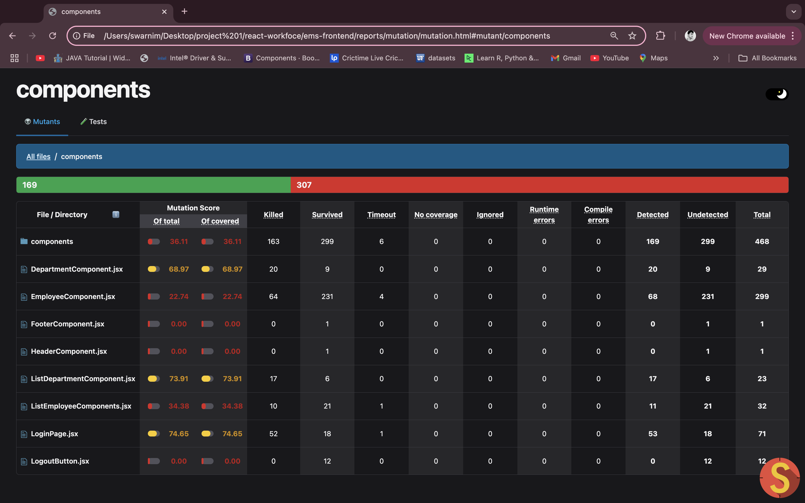

# Employee Management System (EMS)

This project is an Employee Management System (EMS) developed using React for the frontend, Spring Boot for the backend, and MySQL for the database. The system allows admins to manage employee data, department lists, and provides login/logout functionality. The project also includes client-side testing and mutation testing using Stryker.

## Project Overview

- **Admin Dashboard:** Manage employees and departments.
- **Login & Logout:** User authentication with role-based access.
- **Department List Management:** Add, edit, and delete departments.
- **Employee List Management:** Add, edit, and delete employees.
- **Client-Side Testing:** Frontend testing for login functionality.
- **Mutation Testing:** Integrated Stryker for mutation testing and bypass testing.

## Technologies Used

- **Frontend:** React
- **Backend:** Spring Boot
- **Database:** MySQL
- **Testing:** Jest, Stryker (Mutation Testing)
- **Client-Side Testing:** Frontend test cases for login, department list management, and employee management.

## Features

- **Login and Logout System:** Secure login functionality with password validation.
- **Employee Management:** CRUD operations for employee management.
- **Department Management:** CRUD operations for department list management.
- **Testing Integration:** Client-side tests for frontend functionality and mutation tests with Stryker.
  
## Setup Instructions

### Prerequisites

- **Node.js** (for React frontend)
- **MySQL** (for database)
- **Java 11+** (for Spring Boot backend)
- **Maven** (for backend dependencies)
- **Docker** (optional for containerization)

### Frontend Setup

1. Clone the repository:

   ```bash
   git clone https://github.com/yourusername/ems.git
   cd ems
   ```

2. Install the dependencies:

   ```bash
   cd client
   npm install
   ```

3. Run the frontend:

   ```bash
   npm start
   ```

### Backend Setup

1. Clone the repository (if not already cloned).

2. Set up the MySQL database and configure the `application.properties` file in the `backend/src/main/resources` folder:

   ```properties
   spring.datasource.url=jdbc:mysql://localhost:3306/ems
   spring.datasource.username=root
   spring.datasource.password=yourpassword
   ```

3. Build the backend:

   ```bash
   cd backend
   mvn clean install
   ```

4. Run the backend:

   ```bash
   mvn spring-boot:run
   ```

### Testing

- For **frontend testing**, run:

   ```bash
   npm test
   ```

- For **mutation testing** using Stryker, run:

   ```bash
   npx stryker run
   ```

## Screenshot

Mutation Testing by Stryker 



## Contributors

- **Swarnim Kukreti (MT2023029)**: Backend, frontend login, and designing test cases for login client-side.
- **Sejal Khandelwal (MT2023069)**: Frontend design and test cases for department list management and employee management.

## License

This project is licensed under the MIT License.
